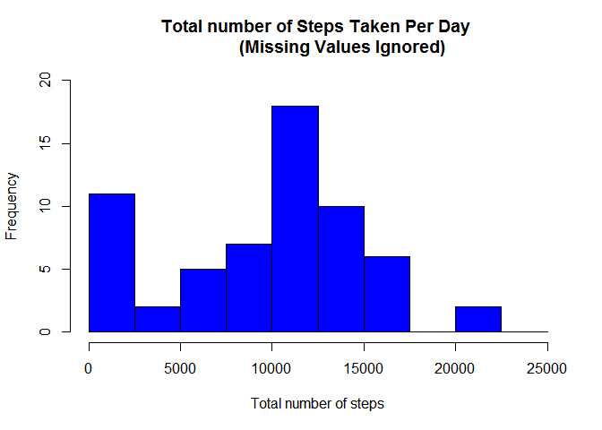
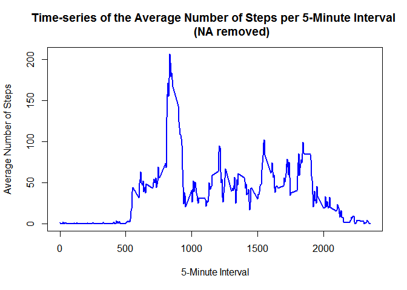
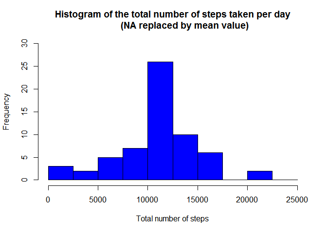
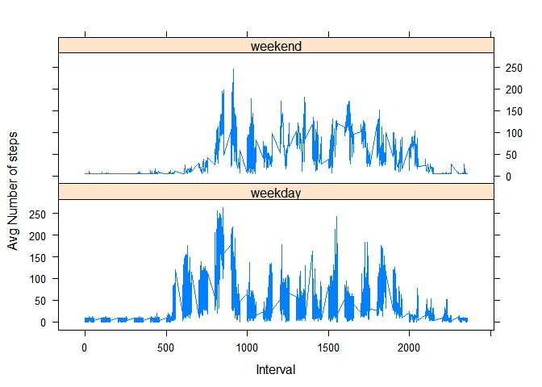

# Reproducible Research: Peer Assessment 1

## Loading and preprocessing the data

```r
# Part1: Load and processing the data
# UnZip the file
if(!file.exists('activity.csv')){
  unzip('activity.zip')
}

# Load the data (i.e. read.csv())
activity_data <- read.csv("activity.csv", stringsAsFactors=FALSE)

# Process/transform the data (if necessary) into a format suitable for analysis
# Transform the input file date to an actual date format
activity_data$date <- as.POSIXct(activity_data$date, format="%Y-%m-%d")

# Compute the weekday from the new date format
activity_data <- data.frame(date=activity_data$date, 
                           weekday=tolower(weekdays(activity_data$date)), 
                           steps=activity_data$steps, 
                           interval=activity_data$interval)

# Compute if the date is a weekend or weekday date
activity_data <- cbind(activity_data, 
                      daytype=ifelse(activity_data$weekday == "saturday" | 
                                     activity_data$weekday == "sunday", "weekend", 
                                     "weekday"))

# Create the data frame to be used below
activity <- data.frame(date=activity_data$date, 
                       weekday=activity_data$weekday, 
                       daytype=activity_data$daytype, 
                       interval=activity_data$interval,
                       steps=activity_data$steps)
```

## What is mean total number of steps taken per day?

```r
# Part2: What is mean total number of steps taken per day?
# 1. Calculate the total number of steps taken per day

sum_data <- aggregate(activity$steps, by=list(activity$date), FUN=sum, na.rm=TRUE)

# Rename the column names
names(sum_data) <- c("date", "total")

# 2. Make a histogram of the total number of steps taken each day
hist(sum_data$total, 
     breaks=seq(from=0, to=25000, by=2500),
     col="blue", 
     xlab="Total number of steps", 
     ylim=c(0, 20), 
     main="Total number of Steps Taken Per Day 
           (Missing Values Ignored)")
```

\

```r
# 3. Calculate and report the mean and median total number of steps taken per day

meansteps <- round(mean(sum_data$total),digits = 0)
mediansteps <-median(sum_data$total)
print(list(Meansteps = meansteps, MedianSteps = mediansteps))
```

```
## $Meansteps
## [1] 9354
## 
## $MedianSteps
## [1] 10395
```


## What is the average daily activity pattern?

```r
# Part3: What is the average daily activity pattern?
# 1. Make a time series plot (i.e. type = "l") of the 5-minute interval (x-axis)
#       and the average number of steps taken, averaged across all days (y-axis)

# Compute the means of steps across all days for each interval
mean_data <- aggregate(activity$steps, 
                       by=list(activity$interval), 
                       FUN=mean, 
                       na.rm=TRUE)
# Rename the columns
names(mean_data) <- c("interval", "mean")

# Compute the time series plot
plot(mean_data$interval, 
     mean_data$mean, 
     type="l", 
     col="blue", 
     lwd=2, 
     xlab="5-Minute Interval", 
     ylab="Average Number of Steps", 
     main="Time-series of the Average Number of Steps per 5-Minute Interval 
           (NA removed)")
```

\

```r
# 2. Which 5-minute interval, on average across all the days in the dataset, 
#    contains the maximum number of steps?

# Find the position and interval value of the maximum mean
max_mean_data <- which(mean_data$mean == max(mean_data$mean))
max_interval <- mean_data[max_mean_data, 1]
print(list(Max_Interval = max_interval))
```

```
## $Max_Interval
## [1] 835
```

## Imputing missing values

```r
# Part4: Imputing missing values
# 1. Calculate and report the total number of missing values in the dataset
#      (i.e. the total number of rows with NA's)

# TRUE boolean value is equivalent to 1 and a FALSE to 0.
NA_count <- sum(is.na(activity$steps))
print(list(Missing_Values = NA_count))
```

```
## $Missing_Values
## [1] 2304
```

```r
# 2. Devise a strategy for filling in all of the missing values in the dataset.
#     - Replacing each NA with the mean of that 5-minute interval
# Find the NA positions
na_pos <- which(is.na(activity$steps))

# Create a vector of means
mean_vec <- rep(mean(activity$steps, na.rm=TRUE), times=length(na_pos))

# 3. Create a new dataset that is equal to the original dataset but with the missing data filled in.
# Replace NA with the means
activity[na_pos, "steps"] <- mean_vec

# 4a. Make a histogram of the total number of steps taken each day
#     and calculate and report the mean and median total number of steps taken per day.
# Compute the total number of steps each day (NA values removed)
sum_data4 <- aggregate(activity$steps, by=list(activity$date), FUN=sum)

# Rename the columns
names(sum_data4) <- c("date", "total")

# Compute the histogram of the total number of steps each day
hist(sum_data4$total, 
     breaks=seq(from=0, to=25000, by=2500),
     col="blue", 
     xlab="Total number of steps", 
     ylim=c(0, 30), 
     main="Histogram of the total number of steps taken per day
          (NA replaced by mean value)")
```

\

```r
# 4b. Calculate and report the mean and median total number of steps taken per day.
meansteps4 <- mean(sum_data4$total)
mediansteps4 <- median(sum_data4$total)
print(list(Mean_Steps_Revised = meansteps4, Median_Steps_Revised = meansteps4))
```

```
## $Mean_Steps_Revised
## [1] 10766.19
## 
## $Median_Steps_Revised
## [1] 10766.19
```

## Are there differences in activity patterns between weekdays and weekends?

```r
# Part5: Are there differences in activity patterns between weekdays and weekends?
# 1. Create a new factor variable in the dataset with two levels - "weekday" and "weekend" indicating whether a given date is a weekday or weekend day.
#      Use the dataset with the filled-in missing values.

# 2. Make a panel plot containing a time series plot(i.e. type = "l") of the 5- minute interval (x-axis)
#       and the average number of steps taken, averaged across all weekday days or weekend days (y-axis).

# Load the lattice graphical library
library(lattice)

# Compute the average number of steps taken, averaged across all daytype variable
mean_data5 <- aggregate(activity$steps, 
                       by=list(activity$daytype, 
                               activity$weekday, activity$interval), mean)

# Rename the columns
names(mean_data5) <- c("daytype", "weekday", "interval", "mean")
#The time series plot take the following form:

# Compute the time serie plot
xyplot(mean ~ interval | daytype, mean_data5, 
       type="l", 
       lwd=1, 
       xlab="Interval", 
       ylab="Avg Number of steps", 
       layout=c(1,2))
```

\

